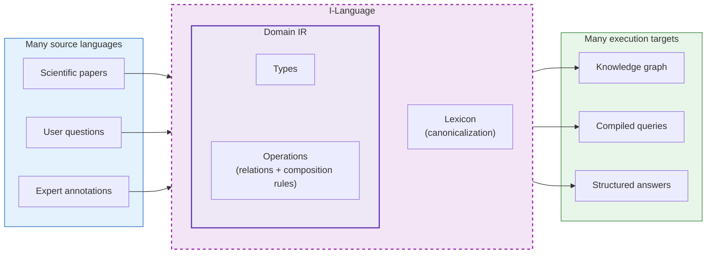
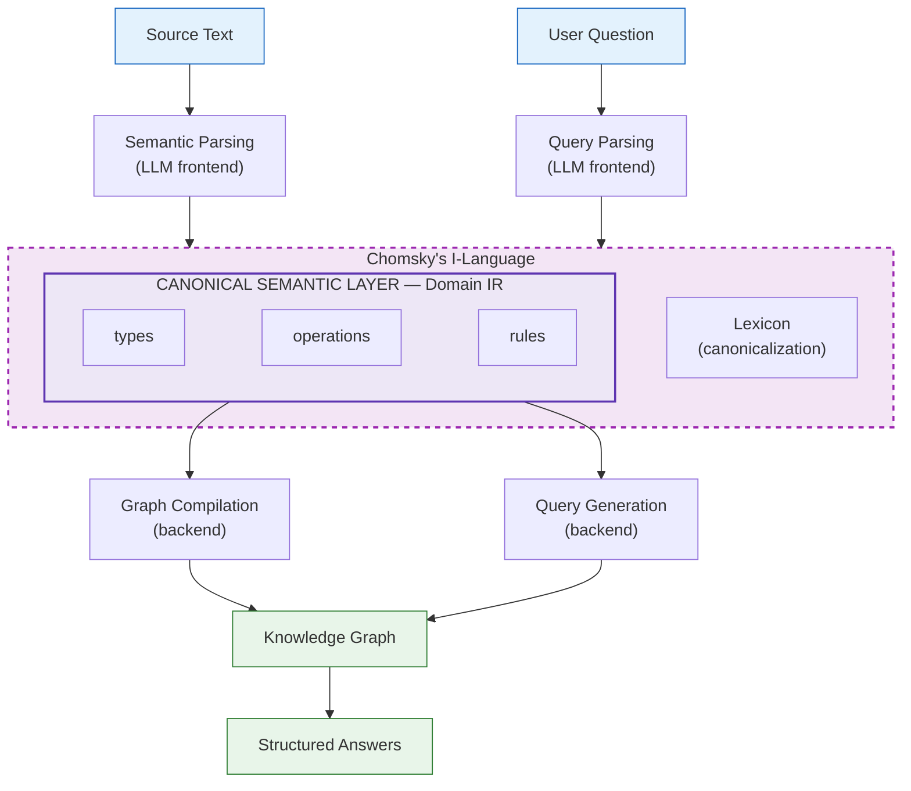

# Domain IR: A Compiler Architecture for Knowledge Systems

**Boris Dev** | March 2026

---

## Abstract

Most AI knowledge systems are RAG pipelines: embed documents, retrieve by similarity, generate text. They work until you need *auditable reasoning* — provenance, contradiction detection, cross-source inference.

This paper describes an alternative: treat domain knowledge extraction as a **compilation problem**. Define a domain grammar — the set of valid semantic structures — and compile source text into typed intermediate representations (IR) that execute against a knowledge graph.

The architecture draws from **compiler design** (LLVM's many-to-one-to-many IR pattern), **Chomsky's I-language** (the distinction between internalized competence and surface performance), and **formal ontology** (BFO's entity/process/artifact type system).

The core claim: **a well-designed intermediate representation, governed by a generative grammar, is more powerful than pattern-matching on surface text**.

---

## 1. The LLVM Insight

LLVM IR sits in the middle of a many-to-one-to-many translation system. Many source languages (C, Rust, Swift) compile to one IR. Many backends (x86, ARM, GPU) compile from it. The IR is the canonical semantic layer — the single representation that decouples all inputs from all outputs.

A Domain IR uses the same architecture:



| Layer | LLVM | Domain Knowledge System |
|-------|------|-------------------------|
| Frontend | C, Rust, Swift parsers | LLM extraction, query parsing |
| IR | LLVM IR | Domain IR (types + operations + rules + lexicon) |
| Backend | x86, ARM code generators | Graph compiler, query generator, evidence views |

The critical property: **all inputs and all outputs compile through the same IR**. Three different users can ask the same question in three different ways:

```
Casual user:  "Is keto good for diabetes?"
Expert:       "Does ketogenic diet reduce HbA1c in T2DM?"
Quantitative: "What's the effect size of keto on HbA1c?"

All three parse to the same IR:

  ContrastFrameQuery(
    intervention = keto_diet,
    outcome      = hba1c
  )
```

The surface language varies. The semantics don't. That is the key.

---

## 2. Domain IR Components

The IR has four components, each with a direct compiler analogy:

| Component | Role | Compiler Analogy |
|-----------|------|------------------|
| **Primitive types** | Entities and processes | Type system |
| **Operations** | Relations between types | Opcodes |
| **Composition rules** | Valid semantic structures | Type rules |
| **Concept lexicon** | Canonicalized vocabulary | Symbol table |

### Primitive types

Grounded in Basic Formal Ontology (BFO) [1], three categories:

| BFO Category | IR Primitive | What it means |
|-------------|-------------|---------------|
| Continuant (entity) | Things that *persist* | "Metformin" exists whether or not anyone is studying it |
| Occurrent (process) | Things that *unfold in time* | "Taking metformin 500mg daily for 12 weeks" has a start and end |
| Information Content Entity (artifact) | Claims about reality | Two findings can contradict each other; both exist in the graph |

### Operations (relations)

A small set of typed edges — the IR's instruction set:

| Edge | From → To | Meaning |
|------|-----------|---------|
| `TESTED` | Finding → Intervention | What was given |
| `FOR` | Finding → Condition | In what context |
| `ON` | Finding → Outcome | Measuring what |
| `VS` | Finding → Comparator | Against what |
| `OBSERVED` | Finding → Effect | The result |
| `ACTS_VIA` | Intervention → Mechanism | How it works |
| `REPORTED_IN` | Finding → Source | Provenance |

### Composition rules

Enforced by schema validation — an invalid structure is a type error:

| Rule | Meaning |
|------|---------|
| A Finding requires intervention + condition + outcome | Core semantic triple |
| An Effect requires a measurement | Effects must reference measurements |
| A ContrastFrame requires intervention + comparator + outcome | Pairwise comparison |

### Concept lexicon

Maps surface forms to canonical concepts, aligned to standard vocabularies:

| Surface Forms | Canonical | Ontology |
|---------------|-----------|----------|
| "keto diet", "ketogenic diet", "LCHF" | `keto_diet` | MeSH |
| "Glucophage", "metformin HCl" | `metformin` | RxNorm |
| "A1c", "glycated hemoglobin" | `hba1c` | LOINC |
| "AMPK activation", "AMP kinase pathway" | `ampk_activation` | Gene Ontology |

---

## 3. The Knowledge Graph Is a Compiled Program

The knowledge graph is not the IR. It is the **compiled output** — the execution-ready representation built from validated IR instances.



The dashed outer box is deliberate. In Chomsky's framework [2], **I-language** is the full internalized computational system — not just the grammar rules, but everything the system has learned from exposure to data. The Domain IR is a strict subset: it keeps only what is needed for deterministic execution, discarding audience framing, lexical variation, and ambiguity. The I-language contains all of that plus the IR. The IR lives *inside* the I-language, not the other way around.

Both flows — extraction and querying — converge at the Domain IR. This is what makes alignment deterministic.

The compilation pipeline mirrors a standard compiler:

| Compiler Stage | Domain System Stage |
|----------------|---------------------|
| Lexing / parsing | LLM extraction from source text |
| AST construction | IR instance creation |
| Type checking | Schema validation |
| Symbol resolution | Concept canonicalization |
| Code generation | Graph patch emission |
| Linking | Graph merge / deduplication |

---

## 4. Minimal Primitives, Derived Concepts

> **Keep primitive operations small. Derive higher-level concepts as patterns.**

| Primitive | Meaning |
|-----------|---------|
| entity | Domain object (condition, population) |
| process | Thing that happens (intervention, mechanism) |
| artifact | Information entity (outcome, measurement) |
| comparison | Pairwise contrast (ContrastFrame) |
| effect | Causal change (direction + magnitude) |

Derived concepts are **queries over primitives**, not new primitives:

| Derived Concept | Composed From |
|----------------|---------------|
| TreatmentBenefit | ContrastFrame + positive Effect |
| SideEffect | Intervention + adverse Outcome |
| DoseResponse | Intervention + Measurement across doses |
| MechanismCluster | Interventions sharing a Mechanism edge |

New questions don't require schema changes — they're new query patterns over existing primitives. This is how the IR stays stable as the corpus grows.

---

## 5. Why Graph, Not SQL. Why Graph, Not LLM.

### Graph vs. SQL

SQL handles single-entity lookups. Graphs win when questions cross entity boundaries — which is every interesting question in a knowledge system.

**"What shares a mechanism with X?"**
SQL: joins across multiple tables, recursive CTEs for sub-mechanisms.
Graph: start at X, follow `ACTS_VIA`, follow back. Two hops. The query reads like the question.

**"What helps with Y but doesn't cause Z?"**
SQL: LEFT JOINs to exclude adverse outcomes. Grows ugly with multiple constraints.
Graph: one `NOT EXISTS` clause per exclusion. Readable. Auditable.

### Graph vs. LLM

An LLM gives you a conclusion. A graph gives you a map you can verify.

| Dimension | LLM | Knowledge Graph |
|-----------|-----|-----------------|
| **Completeness** | Frozen training snapshot; can't tell you what it's missing | Contains all extracted claims |
| **Provenance** | Can't show *why* it believes something | Every claim traces to its source |
| **Contradictions** | Averages or hedges | Both sides coexist as first-class nodes |
| **Auditability** | "Trust my paragraph" | "Trace the subgraph yourself" |

The correct answer to a complex knowledge question is not a paragraph. It is a subgraph — a set of typed nodes connected by typed edges, each traceable to a source.

---

## 6. The I-Language Lens

The compiler analogy is primary. But Chomsky's framework [2] provides vocabulary that the compiler tradition lacks.

In Chomsky's Minimalist Program [3], **I-language** (internalized language) is not the grammar rules alone — it is the whole computational system built from exposure to data. The grammar is the spec; the I-language is the instantiated competence.

| Chomsky | Domain Compiler | Why it matters |
|---|---|---|
| **Grammar** (formal rules) | Type definitions, edge types, composition rules | What structures are *legal* |
| **I-language** (internalized system) | Grammar + canonical concepts + populated KG + pipelines | What the system actually *knows* |
| **Primary linguistic data** | Source corpus | The input from which competence is acquired |
| **Competence** | What the grammar can express | Valid structures, independent of any execution |
| **Performance** | What extraction actually produces | Particular executions, subject to LLM errors |

Two systems with identical grammars but different corpora have different I-languages — just as two speakers with the same Universal Grammar but different linguistic exposure have different I-languages.

### I-Language ⊃ Domain IR

The Domain IR is a strict, deterministic subset of the I-language. The I-language includes audience framing, lexical variation, ambiguity, and pragmatic context — dimensions that the IR deliberately discards:

| Dimension | I-Language | Domain IR |
|-----------|:----------:|:---------:|
| Ontology (entities, processes) | yes | yes |
| Causal/evidence structure | yes | yes |
| Audience framing | yes | no |
| Lexical variation | yes | no |
| Ambiguity | yes | no |
| Pragmatics / context | yes | no |

The IR keeps only what is needed for deterministic execution. Everything else is resolved during semantic parsing (the frontend step). This is why three different audience phrasings collapse to one IR instance.

---

## 7. Grammar vs. Schema

A distinction that matters for system evolution:

A schema is a **serialized structural specification**: fields, types, enums, constraints. A domain grammar is the **generative rule system** from which schemas are derived.

The key difference: **a schema does not expose its own derivation.**

| | Schema | Domain Grammar |
|---|---|---|
| **Contains** | Fields, types, constraints | All of schema + dependency chains, ontological categories, composition rules, extension invariants |
| **Generative?** | No — it is a product | Yes — it is an engine |
| **Evolvable?** | Only by hand | New valid schemas can be derived from it |

Most organizations build bottom-up: engineer writes schema → schema is opaque → someone writes a data dictionary to translate it back into English. The grammar-first approach is top-down: ontology → domain grammar → schemas are *generated*. Meaning comes first. Structure is derived.

The grammar *is* the living, executable data dictionary.

---

## 8. Entity vs. Process: Why the Split Matters

The entity/process distinction (from BFO [1]) gives three engineering rules for free:

**Rule 1: Entities share across sources. Processes don't.**

```
// BAD: temporal detail baked into entity
(:Intervention {name: "metformin", dose: "2g/day", duration: "24w"})

Two sources with different doses fork into N copies.
Cross-source queries require fuzzy matching.
```

```
// GOOD: entity (shared) + process (per-source)
(:Intervention {name: "metformin"})
   ←[:REALIZES]─ (:Course {dose: "2g/day",   duration: "24w"})  // Source A
   ←[:REALIZES]─ (:Course {dose: "500mg/day", duration: "12w"})  // Source B

One entity node. Two process instances.
All queries traverse through a single shared node.
```

**Rule 2: Processes carry temporal structure. Entities don't.**
If you put "duration: 12 weeks" on an entity node, two sources with different durations can't share it.

**Rule 3: Artifacts are epistemic — they assert claims, not facts.**
Two findings can contradict each other and both coexist in the graph. This is what makes contradiction detection possible.

---

## 9. Error Taxonomy

Three error categories, mirroring compiler error classes:

| Error Class | Compiler Analog | Example | Caught By |
|-------------|----------------|---------|-----------|
| **Syntax error** | Parse error | Missing required field, type mismatch | Schema validation |
| **Semantic error** | Type error (compiles but wrong) | Labeling an adverse effect as "improvement" | Gold-standard evaluation |
| **Linking error** | Wrong symbol resolution | "pelvic floor training" → `physical_therapy` instead of `pelvic_floor_training` | Query-level evaluation |

### Where the compiler analogy breaks down

1. **Compilers have deterministic frontends.** Our frontend (LLM extraction) is stochastic. The same source text may produce different IR instances on different runs.

2. **Compilers preserve semantics.** A correct compiler guarantees the compiled program means the same as the source. Our system *lossy-compresses* — a long document becomes a handful of structured claims.

3. **Compilers don't need gold standards.** Compiler correctness is provable. Our system's correctness is empirical — measured against human annotations, not proven by construction.

These limitations are fundamental, not incidental. They are why a Domain IR system needs evaluation suites, error taxonomies, and provenance chains — the machinery that compilers get for free from formal language theory.

---

## 10. Build Principles

### Grammar is discovered, not just defined

The model above is linear (ontology → grammar → schema). The actual system is a flywheel:

```
source text → AI extraction → reveals grammar gaps → grammar evolves → re-extraction → re-eval
```

Each source document is "primary linguistic data" (in Chomsky's sense) that shapes the system's evolving I-language. The grammar is never finished.

### Cycle depth and blast radius

| Layer | Change frequency | Blast radius |
|---|---|---|
| Prompts / mappings | Every session | Local |
| Schema / artifacts | Weekly | Moderate — re-derive downstream |
| Domain grammar | Monthly | Large — new extraction + query patterns |
| Ontology | Rarely | Structural — ripples everywhere |

Most improvement is shallow (fix a prompt, add an alias). Deep changes (add a new ontology primitive) are rare but transformative.

### Ambiguity is the main enemy

An LLM reduces ambiguity *probabilistically* — it picks the most likely interpretation. A domain grammar eliminates ambiguity *formally* or, when elimination is impossible, surfaces it explicitly.

---

## References

[1] Arp, R., Smith, B., & Spear, A.D. (2015). *Building Ontologies with Basic Formal Ontology*. MIT Press. — BFO provides the upper ontology: Continuant (entities), Occurrent (processes), Information Content Entity (artifacts).

[2] Chomsky, N. (1986). *Knowledge of Language: Its Nature, Origin, and Use*. Praeger. — The I-language / E-language distinction: I-language is the internalized computational system; E-language is the set of externalizations.

[3] Chomsky, N. (1995). *The Minimalist Program*. MIT Press. — Merge as the basic structure-building operation, the competence/performance distinction, the primacy of internal grammar over surface realization.

[4] Aho, A.V., Lam, M.S., Sethi, R., & Ullman, J.D. (2006). *Compilers: Principles, Techniques, and Tools* (2nd ed.). Addison-Wesley. — The dragon book. Source → IR → executable is the canonical pipeline this architecture adapts.

[5] Lattner, C. & Adve, V. (2004). "LLVM: A Compilation Framework for Lifelong Program Analysis & Transformation." *CGO '04*. — The many-to-one-to-many IR pattern that this architecture generalizes to knowledge domains.

[6] Rindflesch, T.C. & Fiszman, M. (2003). "The interaction of domain knowledge and linguistic structure in natural language processing." *J Biomed Inform*, 36(6), 462-477. — SemMedDB: subject-predicate-object triples from biomedical text.

[7] Pan, S. et al. (2024). "Unifying Large Language Models and Knowledge Graphs: A Roadmap." arXiv:2306.08302. — Surveys LLM + KG integration as a paradigm distinct from pure LLM or pure KG approaches.

[8] Yih, W. et al. (2015). "Semantic Parsing via Staged Query Graph Generation." *ACL*. — Staged query construction paralleling the question → IR → compiled query pipeline.

[9] Montague, R. (1973). "The Proper Treatment of Quantification in Ordinary English." In *Approaches to Natural Language*. — Composing meaning from parts via formal grammar. A more precise analogy than Chomsky's I-language for what composition rules actually do.
