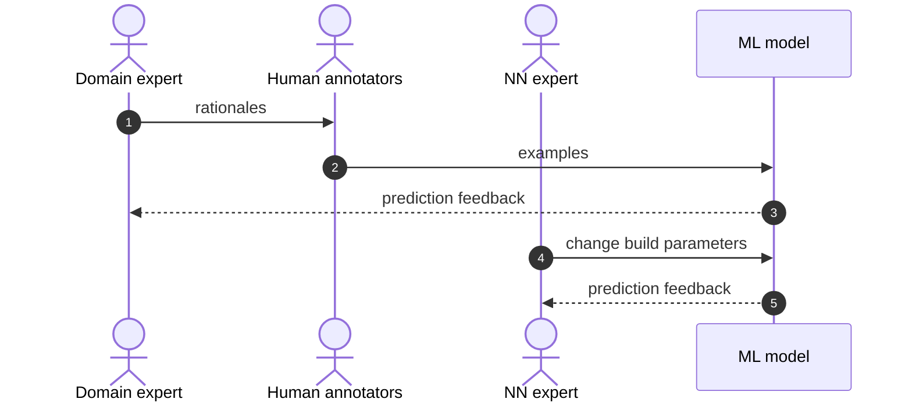
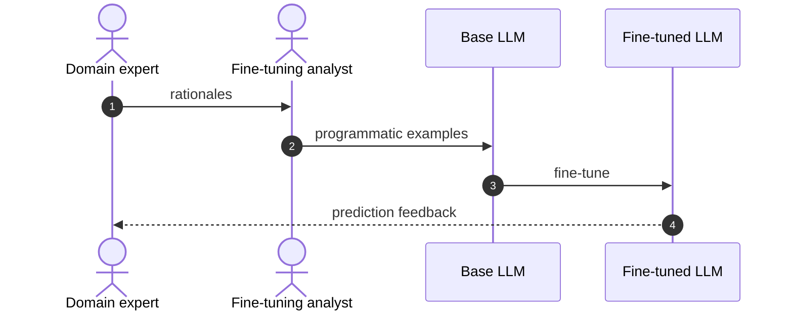
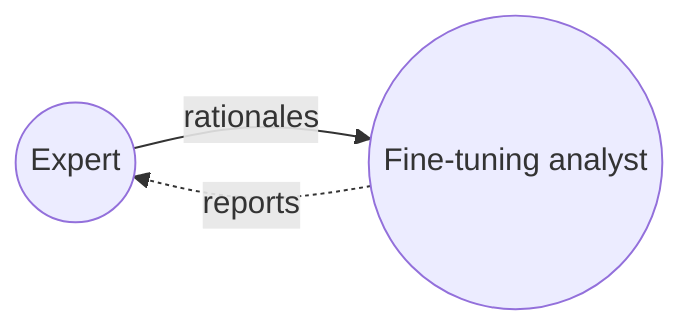

# Fine-tuning LLMs will restructure your data science team

*How fine-tuned LLMs can replace human annotation pipelines and the NN-optimization role — and what the new team looks like.*

## TL;DR

If your AI feature depends on a text classification model, consider building a proof of concept by fine-tuning an LLM instead of training your own model from scratch. Fine-tuning addresses several problems at once:

- low labeling quality
- slow labeling speed
- no in-house neural-network expertise
- no in-house MLOps expertise

The deeper consequence — and the focus of this paper — is that fine-tuning forces a fundamental change in *how ML projects are organized*. Two old roles disappear (or shrink dramatically): the human annotation team and the neural-network optimization scientist. One new role takes their place: the **fine-tuning analyst**.

## The problem we're focused on

The software problem in scope is building a niche text classifier. The purpose of a niche classifier is to scale the mental model of a domain expert — for example, deciding which support tickets are urgent, or which legal invoice line items are non-compliant.

Some things do not change with LLMs. The root problem is still that you need to get your expert's domain knowledge into a computational prediction model. That is the same whether you use human annotators or fine-tune an LLM. The work is still iterative:

1. Distill your expert's mental model into labeled examples.
2. Train a computer model with those examples.
3. Analyze the resulting predictions.
4. If good enough, launch. Otherwise figure out where you missed in modeling your expert's knowledge, and repeat.

What changes is *who does steps 1–3* and *how fast they can do them*.

## Why human annotation often produces low-quality output

The purpose of human annotators is to scale your expert in order to train the model faster. The problem is that it is not trivial to transfer the mental model of your expert to the human annotators. The lag between giving annotators new guidance and seeing whether it improved model performance is long, and the signal at the end is noisy. By the time you discover the rubric was wrong, you have paid for thousands of mislabeled examples.

## Fine-tuning vs. prompt design

An off-the-shelf LLM cannot reliably produce niche classifications using prompting alone. Niche means the model has to internalize specialized rules and terminology that aren't well represented in its pre-training. Fine-tuning is the mechanism by which the expert's mental model gets compiled into the model's weights.

## How the workflow changes

### The old way to run one experiment

### The new way to run one experiment

### Summary of differences

| Topic                              | Step  | How the new replaces the old                                          |
| ---------------------------------- | ----- | --------------------------------------------------------------------- |
| Representing expert's mental model | 1     | Coded rationales replace natural-language rationales.                 |
| Human annotation                   | 2     | The fine-tuning analyst replaces the human annotation team.           |
| Training examples                  | 2     | A fast, reproducible process replaces a slow, non-reproducible one.   |
| Feedback                           | 3     | Quick but more complex feedback analysis replaces a slow, simple one. |
| Model architecture                 | 4, 5  | An external service makes the expensive NN R&D loop unnecessary.      |

## A new relationship: the expert and the analyst

The fine-tuning analyst is the new player in the game. The analyst transforms the expert's rationales into code that produces examples to fine-tune the LLM, then reports results back to the expert so the expert can refine the rationale.

Success depends on the quality of this collaboration. It is a relationship that did not exist in the old workflow, and it demands a different skill set than the NN optimization scientist of the past:

- The analyst works much more intensely with the expert and needs strong **cognitive empathy**.
- The analyst does **not** need sophisticated knowledge of neural network architecture.
- The analyst performs **heavy exploratory data analysis** — the work resembles the kind of analyst role described in [HBR's "What Great Data Analysts Do"](https://hbr.org/2018/12/what-great-data-analysts-do-and-why-every-organization-needs-them) more than it does traditional ML engineering.

## A decision framework

Before reorganizing, run a small experiment. The question to answer empirically is whether **the cost to reach your benchmark with a fine-tuning analyst is lower than the cost with human annotators plus an NN optimization scientist.** Pick a representative slice of your problem, run both pipelines side by side, and measure cost-to-benchmark, not just final accuracy.

If the new approach wins on your problem, you have grounds to restructure. If it doesn't, you've learned why — and the rationale document you produced along the way will make your old pipeline better too.

## Further reading

- [OpenAI's fine-tuning guide](https://platform.openai.com/docs/guides/fine-tuning)
- [OpenAI's fine-tuned classification example](https://github.com/openai/openai-cookbook/blob/main/examples/Fine-tuned_classification.ipynb)
- [Snorkel: Better not bigger — how to get GPT-3 quality at 0.1% the cost](https://snorkel.ai/better-not-bigger-how-to-get-gpt-3-quality-at-0-1-the-cost/)
- [Data-Centric AI](https://github.com/HazyResearch/data-centric-ai)
