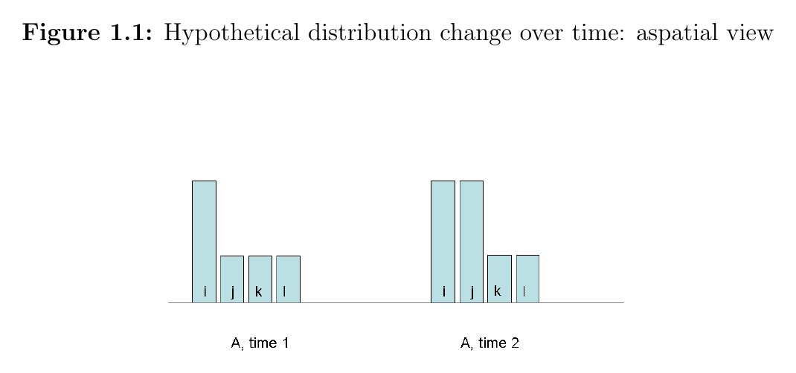
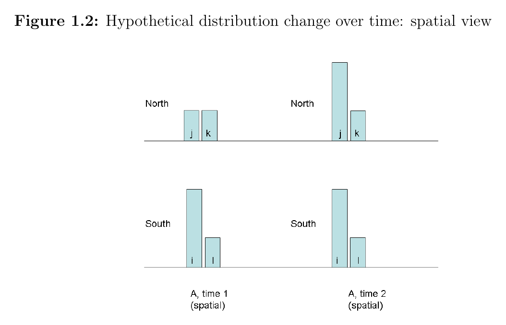

# Inequality Without a Spatial View

*A note drawn from my 2014 dissertation, [Assessing Inequality using Geographic Income Distributions](https://escholarship.org/content/qt8br7d5df/qt8br7d5df.pdf) (UC Santa Barbara / SDSU). I'm including it here because the dissertation's "spatial view" is, in modern terms, a graph representation. The same move — keep the relational structure, don't flatten it — recurs in the knowledge-engineering work on the rest of this site.*

## Same numbers, different worlds

Standard inequality metrics — variance, the Gini coefficient — implicitly weight every pair of places the same. That's a hidden assumption, and it can hide what matters.



Four places (i, j, k, l). At time 1, one is rich, three are poor. At time 2, two are rich, two are poor. Both situations look like roughly the same kind of inequality.

Now look at the same change with the geographic labels restored:



> *"...aspatial metrics, those not incorporating a spatial view, would quantify both inequality situations in the diagrams as identical."*
> — dissertation, §1.2

Once you see the labels in 1.2, the change reads differently. The poorer Northern place *k* is now adjacent to a rising-income *j*; the people in *k* may have to compete for local resources — schools, housing, services — against the wealth next door. The aspatial picture treats this as one of many similar redistributions. The spatial picture suggests one situation is plausibly *worse* than the other, even though the global statistics are unchanged.

## What "spatial view" means

A *spatial view* is a weighting scheme that says some income differentials between pairs of places matter more than others. Different concerns call for different spatial views.

Formally, the dissertation captures this with a **spatial weights matrix W**, where each entry is:

```
w_ij = 1   if P(x_i) ≠ P(x_i | x_j)     (i and j are interdependent)
w_ij = 0   otherwise
```

Place *i* is connected to place *j* if knowing *j*'s outcome changes our belief about *i*'s. Both cooperative dependence (a city's growth lifting a contiguous rural economy) and competitive dependence (neighborhoods competing for local resources) qualify.

**This is a graph.** **W** is an adjacency matrix; each place is a node; edges encode heterogeneous interdependence. The "spatial view" is just a graph view — places relate to other places through specific channels, not as a bag of values.

## Two directions of concern: unfairness vs. suffering

Section 1.7 of the dissertation splits inequality concerns by direction of causality:

**Unfairness as a cause.** Income differentials as evidence about institutions. From Rawls (*A Theory of Justice*, 1999, p.78): *"Eventually the resulting material benefits spread throughout the system to the least advantaged."* If that doesn't happen — if dispersion grows or persists — the basic structure may be regulating shares of primary goods unjustly (Rawls and Kelly, 2001). The relevant graph here connects places that share a political system.

**Suffering as an effect.** Income differentials as a cause of capability deprivation. Sen extends Adam Smith's *Smithian interdependencies*: appearing in public without shame depends on what your neighbors wear. Relative deprivation matters because it is *instrumental* — it deprives people of absolute capabilities (health care, schooling, social participation). The relevant graph here connects places close enough to compete for local resources, or share schools, or otherwise interact daily.

The same change can register opposite verdicts under these two views. Suppose richer households move adjacent to poorer ones:

- **Irrelevant** under unfairness — it's an endogenous, voluntary change, not an institutional act.
- **Better** under the social-encounter view — more cross-class contact.
- **Worse** under the resource-competition view — intensified local competition.

This is the dissertation's central paradox, stated in the abstract:

> *"...spatial inequality metrics formulated for different concerns can register the same change in opposite directions."*

## Aggregate metrics smuggle in moral commitments

The conclusion makes the methodological point that has stayed with me:

> *"Formulas for computing inequality statistics are not transparent in how they make implicit spatial generalizations... evaluation of this spatial presumption cannot be done in a manner that is as objective as it may appear to be by the equations within which they are embedded. This is because such evaluations must be informed by normative considerations."*
> — dissertation, ch. 5

In other words: every aggregate metric implicitly chooses a spatial view, and that choice encodes a moral concern. When the spatial view is hidden inside the formula — wrapped up in a single number — the moral commitment becomes invisible. *Choosing* the spatial view, explicitly, is the act of taking the concern seriously.

## Connection to the rest of the site

The dissertation's "spatial view = graph" maps onto the same move I keep making in [the IR-compile pattern](boris_dev_resume.md#common-pattern):

| Flattened | Relational |
|---|---|
| Variance / Gini over place values | Spatial weights **W** + values |
| Vector embedding similarity | Knowledge graph + typed edges |
| RAG-style flat retrieval | IR-compiled queries against typed nodes |

Each right-hand column keeps the relational structure that the left flattens away. The form of the argument is the same in 2014 inequality measurement and in 2026 LLM knowledge systems: domains that look alike at the value level can differ sharply in their relational structure, and the choice of how to keep that structure is a normative choice — not just an engineering one.

---

*Full dissertation: [Assessing Inequality using Geographic Income Distributions](https://escholarship.org/content/qt8br7d5df/qt8br7d5df.pdf), UC Santa Barbara and San Diego State University, 2014. Committee: Sergio Rey (chair), Arthur Getis, Stuart Sweeney, David Carr.*
