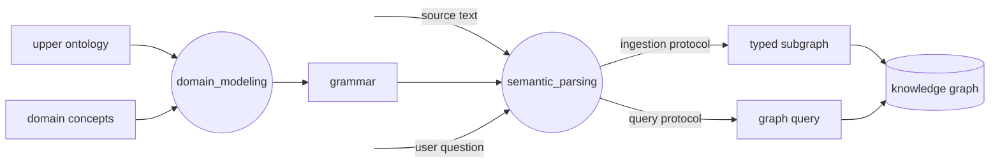
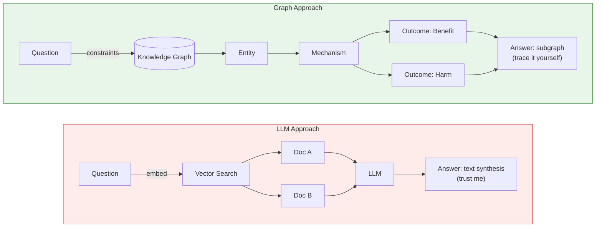

# Domain Grammar as Compiler Architecture for Knowledge Systems

**Boris Dev** | March 2026

---

```
              Ontology (primitives + relations)
                 │
                 │  constrains
                 ▼
            Domain Grammar (valid semantic structures)
                 │
                 │  guides parsing
                 ▼
Question ────► Concept IR ◄──── Source Text
                 │                  │
                 ▼                  ▼
            Query Plan         Graph Patch
                 │                  │
                 └──► Knowledge ◄───┘
                        Graph
```



---

## Abstract

Most AI knowledge systems are RAG pipelines: embed documents, retrieve by similarity, generate text. They work until you need *auditable reasoning* — provenance, contradiction detection, cross-source inference.

This paper describes an alternative: treat domain knowledge extraction as a **compilation problem**. Define a domain grammar — the set of valid semantic structures — and compile source text into typed intermediate representations (IR) that execute against a knowledge graph. The grammar is the single artifact that governs extraction, querying, and schema evolution.

The architecture draws equally from **compiler design** (source → IR → executable) and **Chomsky's Minimalist Program** (I-language, competence vs. performance, the primacy of internal grammar over surface form). Both traditions converge on the same insight: *a well-designed intermediate representation, governed by a generative grammar, is more powerful than pattern-matching on surface text*.

---

## 1. The Core Idea

A domain grammar is a generative rule system that defines:

- **What concept classes exist** (entities, processes, artifacts)
- **What compositions are valid** (a Finding must bind an intervention to an outcome via an observed effect)
- **What transformations are legal** (source text → Concept IR → Query Plan or Graph Patch)

From this grammar, everything else is derived: Pydantic schemas, graph schemas, table DDL, extraction prompts, query templates.

| Compiler | Linguistics (Chomsky) | This System |
|----------|-----------------------|-------------|
| Source code | Surface form (E-language) | Source text / user question |
| Parser | Grammar rules | Domain grammar |
| AST / IR | Deep structure | Concept IR |
| Machine code | Logical form | Executable form (Query Plan / Graph Patch) |
| Runtime | — | Knowledge Graph |

The compiler analogy dominates because the later stages are *execution artifacts*, not meaning representations. But the Chomsky parallel is not decorative — it provides the conceptual vocabulary for reasoning about the system's competence independently of any particular execution.

---

## 2. Five Layers

### Layer definitions

| Layer | Role | Static or Derived? |
|-------|------|--------------------|
| **Ontology** | Primitive types + relations | Static, designed |
| **Domain Grammar** | Valid semantic structures built from ontology types | Static, designed (empirically tuned) |
| **Concept IR** | Parsed, canonicalized meaning instances | Derived from source text + grammar |
| **Executable Form** | System-ready operations | Derived from Concept IR |
| **Knowledge Graph** | Instantiated ontology | Accumulated from Graph Patches |

### Key relationships

- **Ontology underdetermines grammar.** Knowing that `Process` and `Entity` exist does not tell you which compositions are valid. That is a design choice.
- **Grammar fully determines schema.** Given a precise grammar, the Pydantic models, graph schema, and DDL can be mechanically compiled. No human decision required.
- **Concept IR is not ontology.** It *uses* ontology types but is a structured meaning instance, not a type definition.

---

## 3. Grammar vs. Schema — The Critical Distinction

A schema is a **serialized structural specification**: fields, types, enums, nesting, constraints. A domain grammar is the **generative rule system** that defines concept classes, dependency chains, allowed compositions, and transformation rules — from which schemas can be derived.

The key difference: **a schema does not expose its own derivation.**

| | Schema | Domain Grammar |
|---|---|---|
| **Contains** | Fields, types, enums, constraints | All of schema + dependency chains, ontological categories, composition rules, extension invariants |
| **Generative?** | No — it is a product | Yes — it is an engine |
| **Evolvable?** | Only by hand | New valid schemas can be derived from it |

The stack: **Grammar creates schemas. Schemas constrain instances. Instances populate the domain.**

### Why you don't need a data dictionary

Most organizations build bottom-up: engineer writes schema → schema is opaque → someone writes a data dictionary to translate it back into English. The data dictionary is a patch — it retrofits meaning onto structure built without it.

A grammar-first system is top-down: design doc + ontology → domain grammar → schema is *generated*. Meaning comes first. Structure is derived. The grammar *is* the living, executable data dictionary.

---

## 4. The I-Language

In Chomsky's framework, **I-language** (internalized language) is the whole computational system built from exposure to data. The grammar is the spec; the I-language is the instantiated competence [1].

In a domain compiler: the grammar defines what structures are legal. The I-language is the grammar *plus* all canonical concepts *plus* the populated knowledge graph *plus* the extraction/query pipelines. Two systems with identical grammars but different corpora have different I-languages.

| Chomsky | Domain Compiler | Why it matters |
|---|---|---|
| **Grammar** (formal rules) | Field definitions, vertex/edge types, query patterns | The explicit specification — what structures are legal |
| **I-language** (internalized system) | Grammar + canonical concepts + KG + pipelines | The operational competence — what the system actually knows |
| **Primary linguistic data** | Source corpus | The input from which the I-language is acquired |
| **Competence** | What the grammar can express | Valid structures, independent of any particular execution |
| **Performance** | What extraction/query actually produces | Particular executions, subject to LLM errors and cost constraints |

The I-language is a cross-cutting surface, not a layer in a stack. It spans both the ETL layer (ingestion) and the query layer (retrieval):

```
  Source text  ──► text2concept_ir  ──┐
                                      ├──► Concept IR
  User question ► query2concept_ir ──┘
                                           │
                                ┌──────────┴──────────┐
                                ▼                      ▼
                          Query Plan             Graph Patch
                          (KG read)              (KG write)
```

Both inputs converge into the **same Concept IR**, then diverge into different executable forms. This symmetry guarantees:

- **Semantic alignment**: questions and answers inhabit the same representational space
- **Explainability**: every answer traces back through the same IR
- **Reproducibility**: same input → same Concept IR → same execution

Most RAG systems embed documents and queries into the same vector space but have no shared *semantic* structure. That is why they hallucinate.

---

## 5. Ontology: Entity vs. Process vs. Artifact

The ontology layer provides three primitive categories, grounded in BFO (Basic Formal Ontology) [2]:

```
┌─────────────────────────────────────────────────────────┐
│  Layer 4: SEMANTIC GRAMMAR                              │
│  Relations that bind concepts into structured claims     │
├─────────────────────────────────────────────────────────┤
│  Layer 3: ARTIFACTS                                     │
│  What we know — claims about reality                     │
├─────────────────────────────────────────────────────────┤
│  Layer 2: PROCESSES                                     │
│  What happens — things that unfold in time               │
├─────────────────────────────────────────────────────────┤
│  Layer 1: ENTITIES                                      │
│  What exists — things that persist through time          │
└─────────────────────────────────────────────────────────┘
```

The core design rule: **model both the handle (entity) and the flux (process), and relate them via participation.**

- An **entity** *persists* — it exists at any point in time you check. "Metformin" exists whether or not anyone is taking it. (BFO: Continuant)
- A **process** *unfolds* — it has temporal parts, a beginning and end. "Taking metformin 500mg daily for 12 weeks" is a process. (BFO: Occurrent)
- An **artifact** asserts a relationship between entities and processes, but is neither. Two artifacts can contradict each other and both exist in the graph. (BFO: Information Content Entity)

### Why the split matters: three engineering rules

**Rule 1: Entities can be shared across sources. Processes cannot.**
Two studies can reference the same intervention node (metformin) and the same condition node (T2D). But the specific dosing course is unique to one study arm. This is what makes cross-source queries work — traversal through shared entity nodes.

**Rule 2: Processes carry temporal structure. Entities don't.**
If you put "duration: 12 weeks" on an entity node, two sources with different durations can't share the same node. The entity/process split prevents this.

**Rule 3: Artifacts are epistemic — they assert claims, not facts.**
Two findings can contradict each other and both coexist in the graph. This is epistemic scoping, and it's what makes contradiction detection possible.

### Entity vs. Process in action

Without the split — broken:

```
// BAD: temporal detail baked into entity
(:Intervention {name: "metformin", dose: "2g/day", duration: "24 weeks"})
```

Two sources with different doses fork the entity into N copies. Cross-source queries require fuzzy matching.

With the split — correct:

```
// GOOD: entity (shared) + process (per-source)
(:Intervention {name: "metformin"})
   ←[:REALIZES]─ (:ExposureCourse {dose: "2g/day", duration: "24w"})   // Source A
   ←[:REALIZES]─ (:ExposureCourse {dose: "500mg/day", duration: "12w"}) // Source B
```

One node. Two process instances. All queries traverse through a single shared entity.

---

## 6. Why Graph over SQL, Why Graph over LLM

### Graph vs. SQL

SQL handles single-entity lookups. Graphs pull ahead when questions cross entity boundaries — which is every interesting question in a knowledge system.

**"What shares a mechanism with X?"**
SQL: 12 joins across 8 tables, recursive CTEs for sub-mechanism traversal.
Graph: start at X, follow `ACTS_VIA` to the mechanism node, follow back. Two hops.

**"What helps with Y but doesn't cause Z?"**
SQL: LEFT JOIN to exclude adverse-event rows. Grows ugly with multiple exclusion criteria.
Graph: one `NOT EXISTS` clause per excluded outcome.

### Graph vs. LLM (ChatGPT)

An LLM gives you a conclusion. A graph gives you a map you can navigate, verify, and challenge.

| | LLM | Graph |
|---|---|---|
| **Completeness** | Frozen training snapshot; can't tell you what's missing | Contains all extracted claims |
| **Provenance** | Can't show *why* it believes something | Every claim traces to source |
| **Contradictions** | Averages or hedges | Both sides coexist as first-class entities |



Three structural advantages:

1. **Auditable precision** — every claim traces to a source node with a real identifier. The citation isn't generated text; it's a node in the graph.

2. **Auditable recall** — the system shows what it considered, what it filtered, and what survived. The user can inspect the query, challenge it, modify it. Try doing that with an embedding similarity search.

3. **Auditable reasoning** — the answer is a subgraph, not text. Every hop is a typed edge. The reasoning path *is* the answer.

---

## 7. Build Principles

### Grammar is discovered, not just defined

The model above is linear (Mission → Grammar → Execution). The actual system is a flywheel:

```
source text → AI extraction → reveals grammar gaps → grammar evolves → re-extraction → re-eval
```

Each source document processed is "primary linguistic data" (in the Chomsky sense) that shapes the system's evolving I-language. The grammar specification is never finished — it co-evolves with the corpus.

### Cycle depth and blast radius

Not every cycle mutates the deepest layer. Deeper changes are rarer, slower, and higher-impact:

| Layer | Change frequency | Blast radius |
|---|---|---|
| **Prompts / rules / mappings** | Every session | Local |
| **Schema / artifacts** | Weekly | Moderate — re-derive downstream |
| **Domain grammar** | Monthly | Large — new extraction + query patterns + evals |
| **Ontology** | Rarely | Structural — ripples everywhere |

Most improvement is shallow (fix a prompt, add an alias). Deep changes (restructure the grammar, add a new ontology primitive) are rare but transformative.

### Ambiguity is the main enemy

An LLM reduces ambiguity *probabilistically* — it picks the most likely interpretation and moves on. A domain grammar eliminates ambiguity *formally* or, when elimination is impossible, surfaces it explicitly so the user decides.

Five classes of ambiguity that attack knowledge systems:

| Class | Example | Grammar component that addresses it |
|---|---|---|
| **Terminology** | "blood sugar" — fasting glucose, HbA1c, or OGTT? | Vocabulary: canonical entities + surface-form mapping |
| **Structural** | "X reduced Y" — compared to what? | Ontology: composition requires comparator edge |
| **Retrieval** | Which candidates were considered? | Compiled queries: deterministic traversal, visible filter logic |
| **Reasoning path** | Same mechanism ≠ same outcome | Reasoning subgraph: shows shared path AND divergent outcomes |
| **Answer composition** | Which variant, dose, metric? | Findings IR: each claim is a separate typed node |

---

## 8. The Rosetta Stone: Multi-IR Translation

A general-purpose knowledge system sits between multiple source languages and multiple query languages. The knowledge graph is the pivot:

```
SOURCE IRs                          QUERY IRs
(each mirrors its source)           (each mirrors the asker)

Source Type A IR ──→                 ←── Audience X IR
                         ┌──┐
Source Type B IR ──→  ──→│KG│←──    ←── Audience Y IR
                         └──┘
Source Type C IR ──→                 ←── Audience Z IR
```

**No source knows about any query type. No query type knows about any source. They only know the graph.**

Each source type gets its own extraction IR that mirrors its natural shape. All compile deterministically to the same serving IR. This is the architectural moat.

### The two-IR pattern

| IR | Purpose | Mirrors |
|---|---|---|
| **Extraction IR** | How the annotator/model reasons | Source structure |
| **Serving IR** | What gets output and queried | User queries |

Sources are structured around their native logic, but users ask flat questions. If we extract in user-query shape, we lose structural detail. If we serve in source shape, users can't query it. Two IRs let each layer use its natural shape.

---

## References

[1] Chomsky, N. (1986). *Knowledge of Language: Its Nature, Origin, and Use*. Praeger. — Introduces the I-language / E-language distinction: I-language is the internalized computational system; E-language is the set of externalizations.

[2] Arp, R., Smith, B., & Spear, A.D. (2015). *Building Ontologies with Basic Formal Ontology*. MIT Press. — BFO provides the upper ontology: Continuant (entities that persist), Occurrent (processes that unfold), Information Content Entity (artifacts/claims).

[3] Aho, A.V., Lam, M.S., Sethi, R., & Ullman, J.D. (2006). *Compilers: Principles, Techniques, and Tools* (2nd ed.). Addison-Wesley. — The dragon book. Source → IR → executable is the canonical compilation pipeline this architecture adapts.

[4] Chomsky, N. (1995). *The Minimalist Program*. MIT Press. — The framework from which we borrow: merge as the basic structure-building operation, the competence/performance distinction, and the primacy of internal grammar over surface realization.

[5] Robinson, I., Webber, J., & Eifrem, E. (2015). *Graph Databases* (2nd ed.). O'Reilly Media. — The case for graph databases over relational for traversal-heavy queries: identity-preserving nodes, typed edges, variable-length paths.
